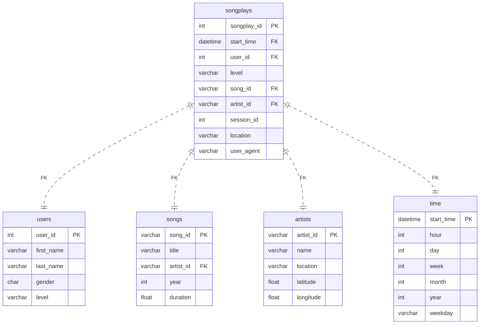

## Project Introduction

Project: Data Warehouse
Introduction
A music streaming startup, Sparkify, has grown their user base and song database and want to move their processes and data onto the cloud. Their data resides in S3, in a directory of JSON logs on user activity on the app, as well as a directory with JSON metadata on the songs in their app.

As their data engineer, you are tasked with building an ETL pipeline that extracts their data from S3, stages them in Redshift, and transforms data into a set of dimensional tables for their analytics team to continue finding insights into what songs their users are listening to.

System Architecture for AWS S3 to Redshift ETL
System Architecture for AWS S3 to Redshift ETL

Project Description
In this project, you'll apply what you've learned on data warehouses and AWS to build an ETL pipeline for a database hosted on Redshift. To complete the project, you will need to load data from S3 to staging tables on Redshift and execute SQL statements that create the analytics tables from these staging tables.

Helpful Hints
Many of the issues that you may have will come from security. You may not have the right keys, roles, region, etc. defined and as a result you will be denied access. If you are having troubles go back to the various lessons where you set up a Redshift cluster, or implemented a role, created a virtual network, etc. Make sure you can accomplish those tasks there, then they should be easy for you to recreate in this project. You are likely to have fewer issues with security if you implement the role creation, setup of the Redshift cluster, and destruction of it via Infrastructure As Code (IAC).
Udacity provides a temporary AWS account for you to build the necessary resources for this project. NB This will REPLACE your AWS credentials which are in your .aws folder. PLEASE make sure you copy those first since they will be overwritten. IF you are having difficulty completing the Project in 1 session (there is a time limit), you MAY find it more effective to use your own AWS account. This would avoid the need to validate your session each time you restart on the project. However, that would be your own funds. It is unlikely that would cost you more than a few dollars.
The starter code that we give you provides a framework for doing this project. The vast majority of your work will be getting the SQL queries part correct. Very few changes will be required to the starter code.
This is an excellent template that you can take into the work place and use for future ETL jobs that you would do as a Data Engineer. It is well architected (e.g. staging tables for data independence from the logs and the final Sparkify DWH) AND bulk data loads into the Sparkify DWH for high compute performance via SQL from those staging tables.

## Course - AWS Sign In and Costs

Launch the AWS Web Console
In this course, Udacity offers you a federated user account, a temporary AWS user account with limited permissions. We call it a Cloud Lab. You can use the Cloud Lab for educational purposes only.

Before you begin, be sure to log out of any AWS accounts you may already have running. Next, click on the Cloud Resources tab to generate the temporary AWS credentials (access keys). You can click on the Open Cloud Console button to go to the AWS console. Review the screenshot below for guidance.

Ensure that you do not have a pop-up blocker installed; it may prevent the new tab from launching. Please be sure to allow pop-ups from Udacity.

Click on the **Cloud Resources** tab to generate the temporary AWS credentials (access keys). You can click on the **Open Cloud Console** button to go to the AWS console. 
Click on the Cloud Resources tab to generate the temporary AWS credentials (access keys). You can click on the Open Cloud Console button to go to the AWS console.

AWS Account Restrictions
1. Session Limit
Note that there is a certain session time limit. If reached, you will automatically be timed out. As long as you have not used your entire allocated budget, your work will be saved. You can re-launch using the same "Launch Cloud Gateway" button in the left navigation menu to return to your session.

2. Default AWS Region
The default AWS region for you will be US East (N. Virginia) (us-east-1 ). In case you need more than one region for your work you can use

us-east-2
us-west-1
us-west-2
Note: You will not have permissions to access regions other than abovementioned ones.

3. Budget
All AWS services are a pay-as-you-go service. Udacity has set a budget for each student to complete their course work. Please understand that these credits are limited and available for you to use judiciously. The budget for this entire course is $25. Although, we find about $10 sufficient for most to complete this course.

If you hit your budget, your session will time out and your work will be lost and unrecoverable.

4. No Extra Credits
We recommend you shut down/delete every AWS resource (e.g., EC2, Sagemaker, Database, EMR, CloudFormation) immediately after the usage or if you are stepping away for a few hours. Otherwise, you will run out of your allocated budget.

Udacity will not provide additional credits. In case you exhaust your credits:

You will lose your progress on the AWS console.

You will have to use your personal AWS account to finish the remaining course/program.

Specifically, any service available to you @$0.1/hour or higher should be monitored closely and shut down immediately after use or if you are stepping away. Otherwise, most likely you will exhaust your credits before finishing the course.

To better understand pricing, see the AWS Pricing(opens in a new tab) for all available services.

Screenshot that shows a list of Amazon services. Check the pricing at https://aws.amazon.com/pricing/
Check the pricing at https://aws.amazon.com/pricing/(opens in a new tab)

5. Track your Usage
You need to make sure that you have an adequate budget available to complete your project/task. You can track your usage on the AWS web console, navigate to Billing and Cost Management > AWS Cost Explorer, and view the spending by selecting a date range. The starting date should be your date of enrollment in this course or program.

Checking costs using the AWS Cost Management Dashboard
AWS Cost Management Dashboard

You can view the AWS Cost Explorer dashboard. However, we have disabled the Billing dashboard for security and privacy reasons.

6. Service Restrictions
You are given a temporary AWS account with limited permissions. You can only use the AWS services required for the course exercises and the projects.

7. Concurrency Limits
A strict limit exists on the number of concurrent (or parallel) instances and resources you can create at any given time. This policy applies to a wide range of AWS services, including EC2, CodeBuild, SageMaker, Lambda, Redshift, Bedrock, Rekognition, Glue, Fargate, and EKS.

The limits set for these services are significantly higher than what is necessary to complete classroom exercises and projects. The exact limits vary by service and may change over time without prior notice.

Consequences of Exceeding Limits: Exceeding these concurrency limits will result in the deactivation of your account and the loss of your cloud lab resources.

Recommendation: Keep your AWS account clean and regularly delete unnecessary resources to avoid hitting the limits. Adhering to these guidelines will ensure uninterrupted access to your AWS resources.

Support: To gain deeper insights into managing AWS credits and concurrency limits effectively, explore the AWS Cloud Lab Best Practices(opens in a new tab) article. Should you encounter further challenges, please contact Udacity Support via our Help Center for additional assistance.

8. Personal Information in AWS
Do not add any type of personal information to the AWS account and resources provided by Udacity for this course. This includes: email addresses, resource names, tags, phone number, name, etc.

9. Account Deletion
Udacity will delete all resources in AWS accounts after several months of inactivity to ensure proper resource utilization and data security. Deleting resources means that all work will be lost and will need to be redone.

Question 1 of 2
Select all of the true statements about AWS usage.

Question 2 of 2
What is the default AWS region set to?

## Project Datasets

You'll be working with two datasets stored in S3. Here are the S3 links for each:

Song data: s3://udacity-dend/song_data
Log data: s3://udacity-dend/log_data
To properly read log data s3://udacity-dend/log_data, you'll need the following metadata file:

Log metadata: s3://udacity-dend/log_json_path.json
Keep in mind that the udacity-dend bucket is situated in the us-west-2 region. If you're copying the dataset to Redshift located in us-east-1, remember to specify the region using the REGION keyword in the COPY command.

Song Dataset
The first dataset is a subset of real data from the Million Song Dataset(opens in a new tab). Each file is in JSON format and contains metadata about a song and the artist of that song. The files are partitioned by the first three letters of each song's track ID. For example, here are file paths to two files in this dataset.

song_data/A/B/C/TRABCEI128F424C983.json
song_data/A/A/B/TRAABJL12903CDCF1A.json
And below is an example of what a single song file, TRAABJL12903CDCF1A.json, looks like.

{"num_songs": 1, "artist_id": "ARJIE2Y1187B994AB7", "artist_latitude": null, "artist_longitude": null, "artist_location": "", "artist_name": "Line Renaud", "song_id": "SOUPIRU12A6D4FA1E1", "title": "Der Kleine Dompfaff", "duration": 152.92036, "year": 0}
Log Dataset
The second dataset consists of log files in JSON format generated by this event simulator(opens in a new tab) based on the songs in the dataset above. These simulate app activity logs from an imaginary music streaming app based on configuration settings.

The log files in the dataset you'll be working with are partitioned by year and month. For example, here are file paths to two files in this dataset.

log_data/2018/11/2018-11-12-events.json
log_data/2018/11/2018-11-13-events.json
And below is an example of what the data in a log file, 2018-11-12-events.json, looks like.

log_data image
log_data image

Log JSON Metadata
The log_json_path.json file is used when loading JSON data into Redshift. It specifies the structure of the JSON data so that Redshift can properly parse and load it into the staging tables.

In the context of this project, you will need the log_json_path.json file in the COPY command, which is responsible for loading the log data from S3 into the staging tables in Redshift. The log_json_path.json file tells Redshift how to interpret the JSON data and extract the relevant fields. This is essential for further processing and transforming the data into the desired analytics tables.

Below is what data is in log_json_path.json.

Contents of `log_json_path.json`
Contents of log_json_path.json

## Project Instructions

Schema for Song Play Analysis
Using the song and event datasets, you'll need to create a star schema optimized for queries on song play analysis. This includes the following tables.

Fact Table
songplays - records in event data associated with song plays i.e. records with page NextSong
songplay_id, start_time, user_id, level, song_id, artist_id, session_id, location, user_agent
Dimension Tables
users - users in the app
user_id, first_name, last_name, gender, level
songs - songs in music database
song_id, title, artist_id, year, duration
artists - artists in music database
artist_id, name, location, latitude, longitude
time - timestamps of records in songplays broken down into specific units
start_time, hour, day, week, month, year, weekday
Project Template
To get started with the project, go to the workspace on the next page, where you'll find the project template. You can work on your project and submit your work through this workspace.

Alternatively, you can download the template files in the Resources tab in the classroom and work on this project on your local computer.

The project template includes four files:

create_table.py is where you'll create your fact and dimension tables for the star schema in Redshift.
etl.py is where you'll load data from S3 into staging tables on Redshift and then process that data into your analytics tables on Redshift.
sql_queries.py is where you'll define you SQL statements, which will be imported into the two other files above.
README.md is where you'll provide discussion on your process and decisions for this ETL pipeline.

Task List
Make sure you have all the resources ready to go for this project before you complete it.

Project Steps
Below are steps you can follow to complete each component of this project.

Create Table Schemas
Design schemas for your fact and dimension tables
Write a SQL CREATE statement for each of these tables in sql_queries.py
Complete the logic in create_tables.py to connect to the database and create these tables
Write SQL DROP statements to drop tables in the beginning of create_tables.py if the tables already exist. This way, you can run create_tables.py whenever you want to reset your database and test your ETL pipeline.
Launch a redshift cluster and create an IAM role that has read access to S3.
Add redshift database and IAM role info to dwh.cfg.
Test by running create_tables.py and checking the table schemas in your redshift database. You can use Query Editor in the AWS Redshift console for this.
Build ETL Pipeline
Implement the logic in etl.py to load data from S3 to staging tables on Redshift.
Implement the logic in etl.py to load data from staging tables to analytics tables on Redshift.
Test by running etl.py after running create_tables.py and running the analytic queries on your Redshift database to compare your results with the expected results.
Delete your redshift cluster when finished.
Document Process
Do the following steps in your README.md file. Here's a guide(opens in a new tab) on Markdown Syntax.

Discuss the purpose of this database in context of the startup, Sparkify, and their analytical goals.
State and justify your database schema design and ETL pipeline.
[Optional] Provide example queries and results for song play analysis. We do not provide you any of these. You, as part of the Data Engineering team were tasked to build this ETL. Thorough study has gone into the star schema, tables, and columns required. The ETL will be effective and provide the data and in the format required. However, as an exercise, it seems almost silly to NOT show SOME examples of potential queries that could be ran by the users. PLEASE use your imagination here. For example, what is the most played song? When is the highest usage time of day by hour for songs? It would not take much to imagine what types of questions that corporate users of the system would find interesting. Including those queries and the answers makes your project far more compelling when using it as an example of your work to people / companies that would be interested. You could simply have a section of sql_queries.py that is executed after the load is done that prints a question and then the answer.
Example Output From An ETL Run
Typical Run With Simple Counts To Validate Success
Typical Run With Simple Counts To Validate Success

Note
The SERIAL command in Postgres is not supported in Redshift. The equivalent in redshift is IDENTITY(0,1), which you can read more on in the Redshift Create Table Docs(opens in a new tab).

Project Rubric
Read the project rubric(opens in a new tab) before and during development of your project to ensure you meet all specifications.

REMINDER: Do not include your AWS access keys in your code when sharing this project!

## Project Rubrict
Table Creation
Criteria	Submission Requirements
Table creation script runs without errors.

The script, create_tables.py, runs in the terminal without errors. The script successfully connects to the Sparkify database, drops any tables if they exist, and creates the tables.

Staging tables are properly defined.

CREATE statements in sql_queries.py specify all columns for both the songs and logs staging tables with the right data types and conditions.

Fact and dimensional tables for a star schema are properly defined.

CREATE statements in sql_queries.py specify all columns for each of the five tables with the right data types and conditions.

ETL
Criteria	Submission Requirements
ETL script runs without errors.

The script, etl.py, runs in the terminal without errors. The script connects to the Sparkify redshift database, loads log_data and song_data into staging tables, and transforms them into the five tables.

ETL script properly processes transformations in Python.

INSERT statements are correctly written for each table and handles duplicate records where appropriate. Both staging tables are used to insert data into the songplays table.

Code Quality
Criteria	Submission Requirements
The project shows proper use of documentation.

The README file includes a summary of the project, how to run the Python scripts, and an explanation of the files in the repository. Comments are used effectively and each function has a docstring.

The project code is clean and modular.

Scripts have an intuitive, easy-to-follow structure with code separated into logical functions. Naming for variables and functions follows the PEP8 style guidelines.

Suggestions to Make Your Project Stand Out
Add data quality checks
Create a dashboard for analytic queries on your new database