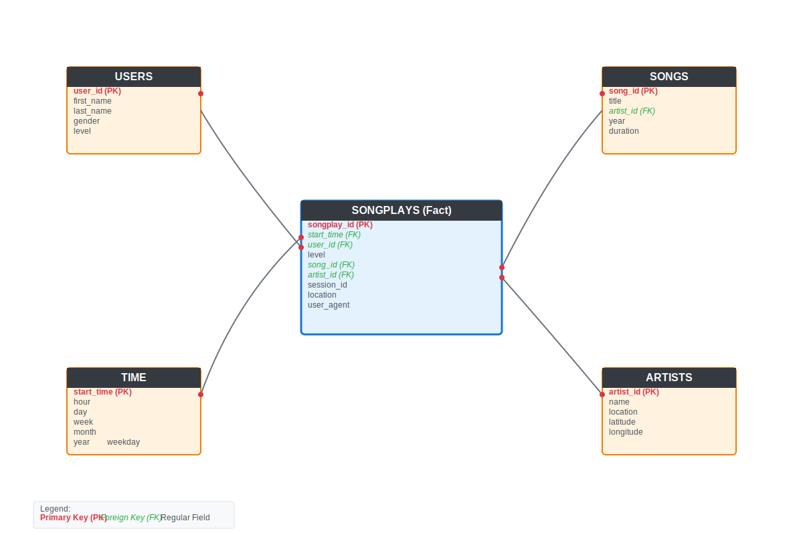
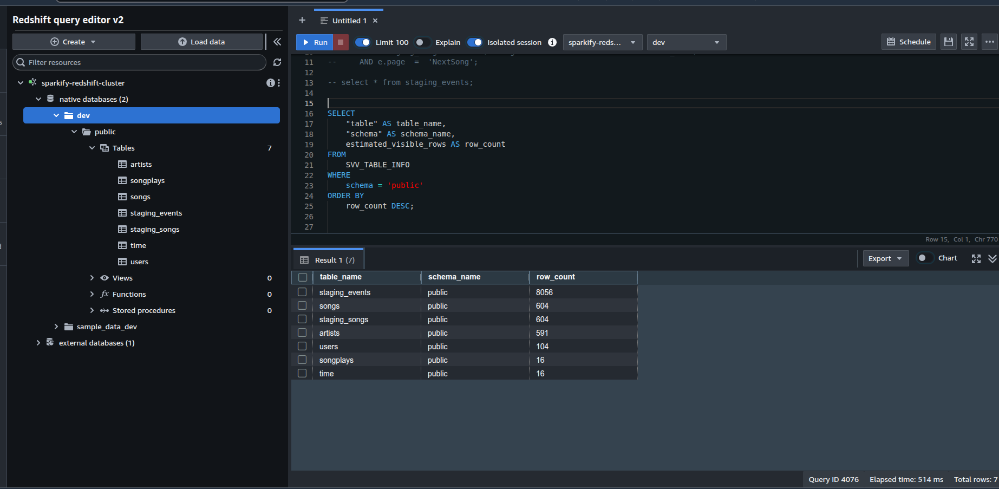

# 🚀 Sparkify Data Warehouse Project

## 📌 Project Summary

* **Startup:** Sparkify (Music Streaming App)
* **Goal:** Migrate user activity logs and song metadata from S3 to Redshift
* **Data Sources:**

  * `log-data`: JSON logs (user activity)
  * `song-data`: JSON metadata (songs)

---

## 🎯 Project Objectives

* Build an **ETL pipeline** to:

  * **Extract** data from Amazon S3
  * **Stage** in Amazon Redshift
  * **Transform** into dimensional model (star schema)
* Enable analytics team to **gain insights** into user listening behavior



---

## 🛠️ How to Run Scripts

### 1. 🔍 Explore Raw Data

List data in S3 buckets:

```bash
aws s3 ls s3://udacity-dend/log-data/ --recursive --human-readable --summarize
aws s3 ls s3://udacity-dend/song-data/ --recursive --human-readable --summarize
aws s3 cp s3://udacity-dend/log_json_path.json .
```

Preview files:

```bash
aws s3 cp s3://udacity-dend/log-data/2018/11/2018-11-30-events.json - | head
aws s3 cp s3://udacity-dend/song-data/B/Z/G/TRBZGTJ128F4276373.json - | head
```

Generate stats:

```bash
python explore/get_datasource_stats.py
```

---

### 2. 🏗️ Create Redshift Cluster with Terraform

1. **Install Terraform**
2. **Configure AWS CLI** with profile named `udacity`:

```ini
# ~/.aws/credentials
[udacity]
aws_access_key_id = YOUR_KEY
aws_secret_access_key = YOUR_SECRET
aws_session_token = YOUR_SESSION_TOKEN
```

3. **Clone this repo**, navigate to `terraform/`:

```bash
cd terraform
terraform init
terraform plan
terraform apply
```

---

### 3. 🚴 Run ETL Pipeline

1. Rename `dwh_copy.cfg` → `dwh.cfg` and fill in:

   * `REDSHIFT_ENDPOINT`
   * `IAM_ROLE_ARN`
2. Install dependencies:

```bash
pip install -r requirements.txt
```

3. Start pipeline:

```bash
sh start.sh
```

---

### ✅ Test Redshift Tables

Query Redshift to validate row counts:

```sql
SELECT
    "table" AS table_name,
    "schema" AS schema_name,
    estimated_visible_rows AS row_count
FROM
    SVV_TABLE_INFO
WHERE
    schema = 'public'
ORDER BY
    row_count DESC;
```



---

## 📊 Sample Analytics Queries

<details>
<summary><strong>1. Top 10 Most Played Songs</strong></summary>

```sql
SELECT s.title, a.name AS artist_name, COUNT(*) AS play_count
FROM songplays sp
JOIN songs s ON sp.song_id = s.song_id
JOIN artists a ON sp.artist_id = a.artist_id
GROUP BY s.title, a.name
ORDER BY play_count DESC
LIMIT 10;
```

</details>

<details>
<summary><strong>2. User Activity by Hour</strong></summary>

```sql
SELECT t.hour, COUNT(*) AS plays, COUNT(DISTINCT sp.user_id) AS unique_users
FROM songplays sp
JOIN time t ON sp.start_time = t.start_time
GROUP BY t.hour
ORDER BY t.hour;
```

</details>

<details>
<summary><strong>3. Monthly Growth in Plays</strong></summary>

```sql
SELECT t.year, t.month,
       COUNT(*) AS total_plays,
       COUNT(DISTINCT sp.user_id) AS active_users,
       COUNT(*) - LAG(COUNT(*)) OVER (ORDER BY t.year, t.month) AS growth
FROM songplays sp
JOIN time t ON sp.start_time = t.start_time
GROUP BY t.year, t.month
ORDER BY t.year, t.month;
```

</details>

<details>
<summary><strong>4–12. More Queries</strong></summary>

The repo includes advanced analytics like:

* Top Artists by Location
* Free vs Paid Engagement
* Weekend vs Weekday Patterns
* User Demographics
* Geographic Listening Heatmap
* Song Duration Preferences
* User Cohort Retention
* Peak Usage Times
* User Session Metrics

All queries are available in [analytics.sql](static/analytics.sql)

</details>

---

## 🔄 Reset Terraform Resources

To destroy the Redshift cluster:

```bash
cd terraform
terraform destroy
```

