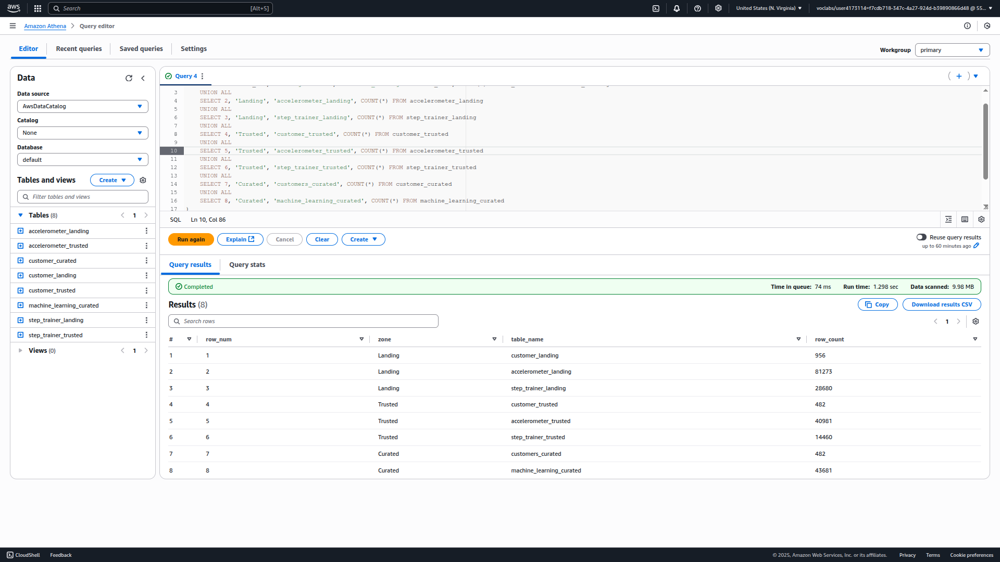
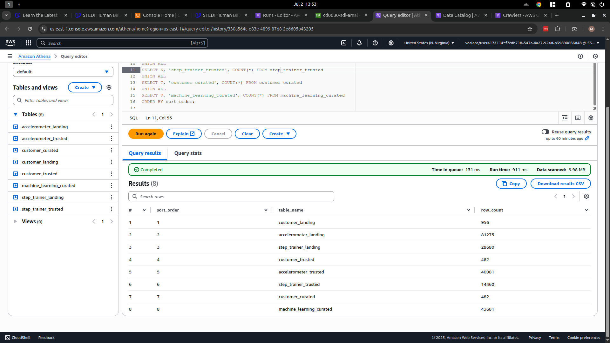
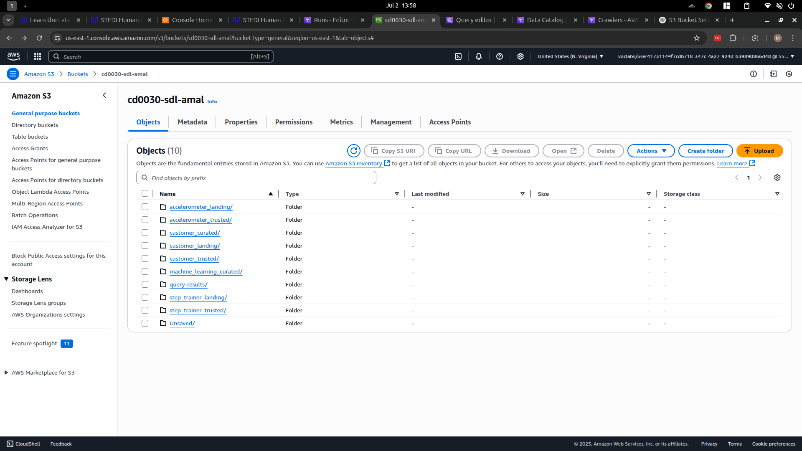
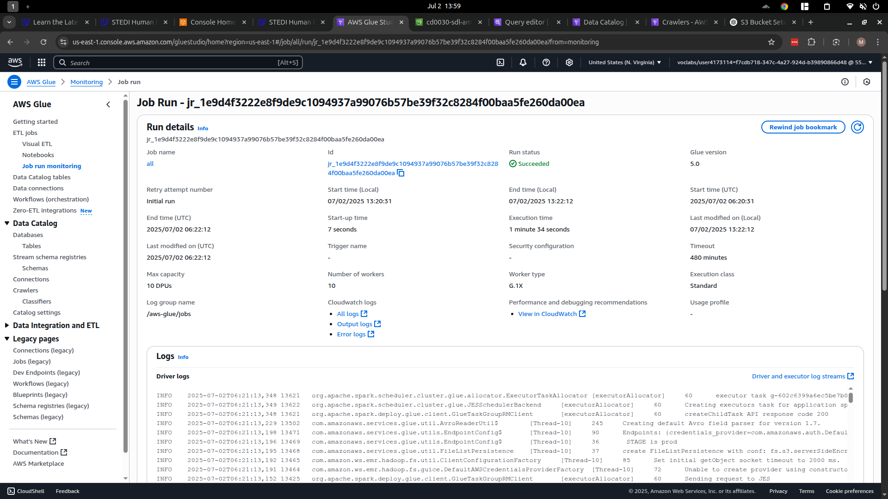
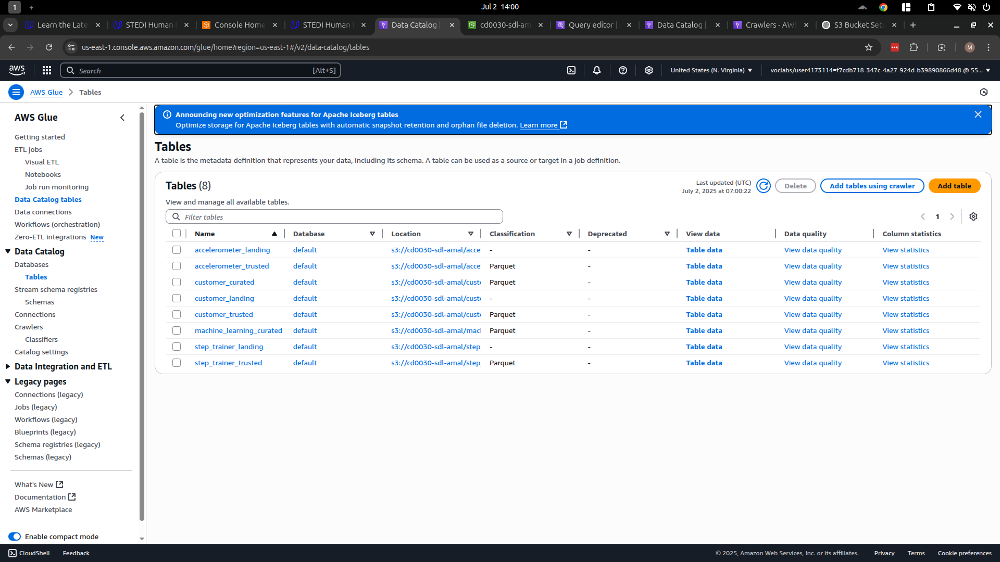

# 🧊 STEDI Data Lake Pipeline on AWS

This project builds a serverless data lake architecture on AWS using S3, Glue, and Athena. It ingests raw JSON files into S3, creates a metadata catalog, transforms the data using a Glue ETL job, and stores trusted and curated datasets for analytics and machine learning.

## 📦 Create S3 Bucket and Upload Sample Data

### 1. **Set Environment Variables**

Update the values as needed:

```bash
BUCKET_NAME=cd0030-sdl-amal   # Replace with a globally unique bucket name
REGION=us-east-1              # Replace with your preferred AWS region
```

### 2. **Create the S3 Bucket**

```bash
aws s3api create-bucket \
  --bucket $BUCKET_NAME \
  --region $REGION
```

### 3. **Clone the Project Repository**

```bash
git clone https://github.com/udacity/nd027-Data-Engineering-Data-Lakes-AWS-Exercises.git
cd nd027-Data-Engineering-Data-Lakes-AWS-Exercises/project/starter
```

### 4. **Upload Sample Data to S3**

Use the following commands to upload JSON files to their respective prefixes:

```bash
aws s3 cp customer/landing s3://$BUCKET_NAME/customer_landing/ \
  --recursive --exclude "*" --include "*.json"

aws s3 cp step_trainer/landing s3://$BUCKET_NAME/step_trainer_landing/ \
  --recursive --exclude "*" --include "*.json"

aws s3 cp accelerometer/landing s3://$BUCKET_NAME/accelerometer_landing/ \
  --recursive --exclude "*" --include "*.json"
```

### 5. ✅ **Verify Uploads**

```bash
aws s3 ls s3://$BUCKET_NAME/customer_landing/
aws s3 ls s3://$BUCKET_NAME/step_trainer_landing/
aws s3 ls s3://$BUCKET_NAME/accelerometer_landing/
```

## 🧭 Create Data Catalog from S3 Landing Zone

Run `landing/create_tables.py` to create metadata tables using Athena SQL.

This step registers the following tables in the AWS Glue Data Catalog:

* `customer_landing`
* `accelerometer_landing`
* `step_trainer_landing`

## 🔄 Run AWS Glue Job for Transformation

Execute `stedi_job.py` to perform data transformation.

This job:

* Reads from landing zone tables
* Outputs trusted and curated datasets to new S3 paths

### Output Tables:

**Trusted Layer:**

* `accelerometer_trusted`
* `customer_trusted`
* `step_trainer_trusted`

**Curated Layer:**

* `customer_curated`
* `machine_learning_curated`

## 🔍 Run AWS Glue Crawler

Run `crawler.py` to detect schema and auto-register transformed tables in the Data Catalog. These tables can then be queried using Athena.

## ✅ Validate with Athena Query

Run the following SQL to verify row counts across all stages:

```sql
SELECT 1 AS sort_order, 'customer_landing' AS table_name, COUNT(*) AS row_count FROM customer_landing
UNION ALL
SELECT 2, 'accelerometer_landing', COUNT(*) FROM accelerometer_landing
UNION ALL
SELECT 3, 'step_trainer_landing', COUNT(*) FROM step_trainer_landing
UNION ALL
SELECT 4, 'customer_trusted', COUNT(*) FROM customer_trusted
UNION ALL
SELECT 5, 'accelerometer_trusted', COUNT(*) FROM accelerometer_trusted
UNION ALL
SELECT 6, 'step_trainer_trusted', COUNT(*) FROM step_trainer_trusted
UNION ALL
SELECT 7, 'customer_curated', COUNT(*) FROM customer_curated
UNION ALL
SELECT 8, 'machine_learning_curated', COUNT(*) FROM machine_learning_curated
ORDER BY sort_order;
```

### Sample Output:





## 🧩 Extras

### 📂 Final S3 Structure

The final layout of your S3 bucket after running the ETL pipeline:



### 🔄 Glue Job Execution

Visual confirmation of a successful AWS Glue job run:



### 📚 AWS Glue Data Catalog Tables

The registered tables in the AWS Glue Data Catalog, ready for querying in Athena:

